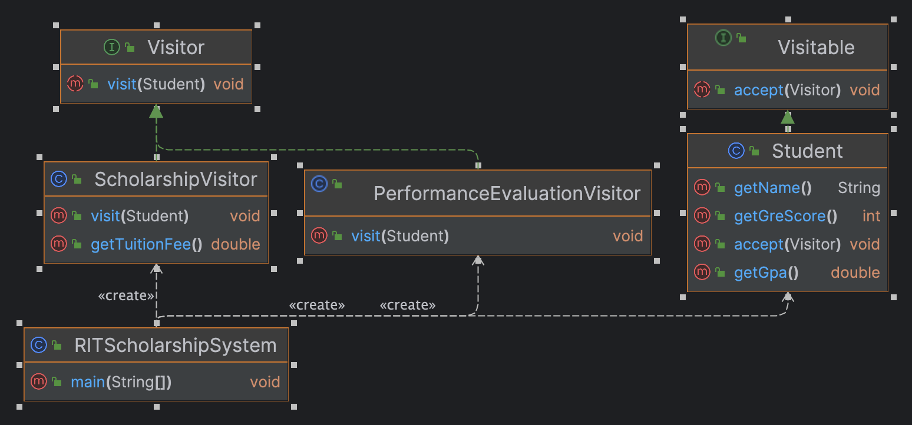

# SWEN-732--Homework-07
SWEN 732: Collaborative software development Homework 07

# RIT Scholarship System

## Overview
This mini-project demonstrate the use of Visitor Design pattern. The RIT Scholarship System is based on Java and evaluates scholarships for incoming student base on their GRE score and bonuses for current students based on their GPA's.

## Features
- **ScholarshipVisitor**: Evaluates students based on their GRE scores. Students with a GRE score greater than 310 are eligible for a 30% scholarship on tuition.
- **PerformanceEvaluationVisitor**: Assesses students' GPAs in subsequent semesters. Students with a GPA above 3.75 receive an additional 5% bonus on their scholarship.

## Classes
- `Student`: Represents the details of a student, including name, GRE score, and GPA. This class implements the Visitable interface, to accept visitors for scholarship evaluation and performance bonus calculation process.
-  `Visitable`: An interface defining the accept method for elements that can be visited by a visitor. In this project, the Student class implements this interface to accept different types of visitor evaluations.
- `Visitor`: An interface defining a visit method for performing operations on elements implementing the Visitable interface. It specifies how a visitor should interact with a student, focusing on the abstract action rather than the specifics.
- `ScholarshipVisitor`: Implements the Visitor interface to evaluate if a student is eligible for a scholarship based on their GRE score. If the score is above 310, the student is awarded a 30% scholarship on tuition fees.
- `PerformanceEvaluationVisitor`: Another implementation of the Visitor interface, which assesses a student's GPA to determine eligibility for a bonus. Students with a GPA above 3.75 receive an additional 5% bonus on their scholarship.

## Usage
Instantiate `Student` objects with their respective names and the scores (GRE or GPAs). Apply `ScholarshipVisitor` to students with GRE scores to calculate scholarships and `PerformanceEvaluationVisitor` for students with GPAs to calculate bonuses.

## Class Diagram

